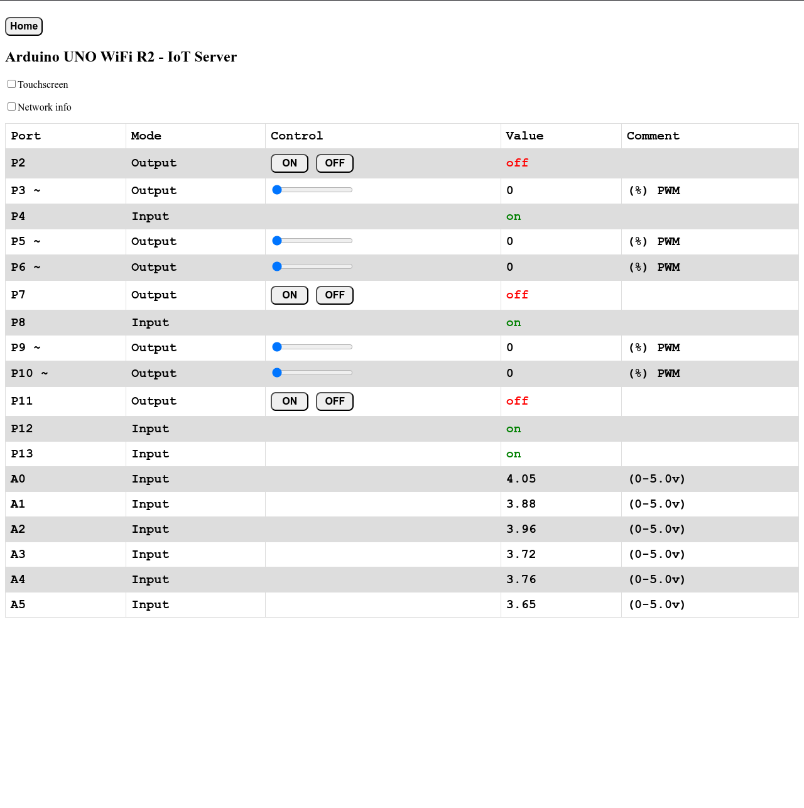

# Introduction

This software is used as an example when teaching my students IoT. It is made for the Arduino UNO WiFi R2 board and is programmed as Server. You must therefore connect to the Arduino via cabled or Wi-Fi network, and not directly to the Arduino. Look at the documentation within the source-code for more information about how to adapt and use the software.

## Basic use

To use this software, you must change the settings for WiFi name (SSID) and WiFi password for the connected network. I have a separate library file for this, placed outside the project area, to keep WiFi name/password hidden for others when showing this example/demo. You can alternatively put WiFi name/password directly in the code, and this is commented in the code.

To adapt the software for your needs, the simplest way of doing this is to change the values in the configuration table. Here you can specify wahat ports to use, input/output, digital/analog (PWM) and so on. This is commented in the code. Many students also like modify HTML-code, to change to more fancy colors, fonts, and so on.

### Configuration table in the code

    // Digital ports     0, 1, 2, 3, 4, 5, 6, 7, 8, 9, 10,11,12,13       Digital Port number
    const bool DPU[] = { 0, 0, 1, 1, 1, 1, 1, 1, 1, 1, 1, 1, 1, 1 };  // Port Used (1=YES, 0=NO)
    const bool DPO[] = { 0, 0, 1, 1, 0, 1, 1, 1, 0, 1, 1, 1, 0, 0 };  // Port Output (1=YES, 0=INPUT)
    const bool PWO[] = { 0, 0, 0, 1, 0, 1, 1, 0, 0, 1, 1, 0, 0, 0 };  // PWM Output (1=YES, 0=NO)
    bool DPV[]       = { 0, 0, 0, 0, 0, 0, 0, 0, 0, 0, 0, 0, 0, 0 };  // Port Value (and default value)
    int PWV[]        = { 0, 0, 0, 0, 0, 0, 0, 0, 0, 0, 0, 0, 0, 0 };  // PWM Value (and default value)

    const String DPN[] = { "P0 (rx)", "P1 (tx)", "P2", "P3 ~",      // Digital Port Names
                        "P4", "P5 ~", "P6 ~", "P7", "P8",        // Digital Port Names
                        "P9 ~", "P10 ~", "P11", "P12", "P13" };  // Digital Port Names

    const String DPC[] = { "(used by serial monitor)", "(used by serial monitor)",  // Digital Port Comments
                        "", "(%) PWM", "", "(%) PWM",                            // Digital Port Comments
                        "(%) PWM", "", "", "(%) PWM",                            // Digital Port Comments
                        "(%) PWM", "", "", "" };                                 // Digital Port Comments

When using av device with touch-screen, you must activate use of touchscreen with the onscreen checkbox. If not, the sliders will probably not work.

## IDE

The software is made with [Arduino IDE 2](https://en.wikipedia.org/wiki/Arduino).

## Screenshots

